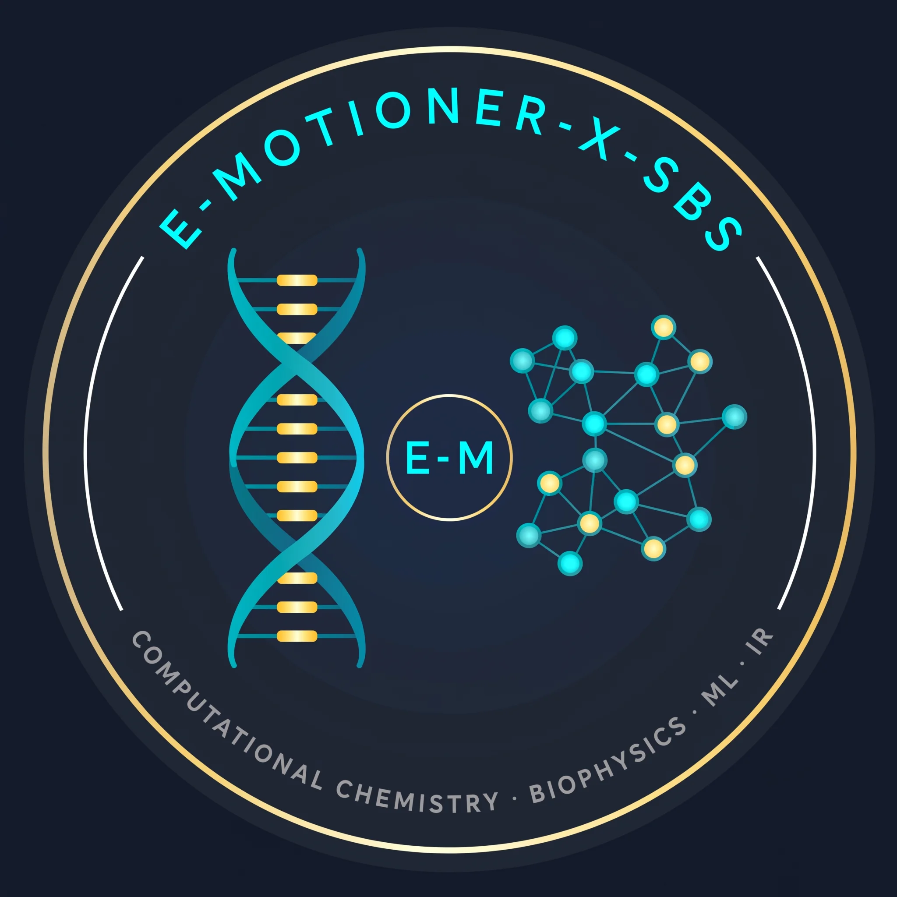

  
  <h1>E-Motioner-X-SBS</h1>
  
<em>Computational Chemistry · Computational Biophysics · ML · Information Retrieval · IISER Kolkata</em>

---

## About the Researcher

**Shuvam Banerji Seal** is a BS-MS student at the Indian Institute of Science Education and Research (IISER), Kolkata, majoring in Computational Chemistry with a minor in Computational Science (domain: Information Retrieval) (CGPA: 8.2). His research bridges computational chemistry, biophysics, and machine learning — with a focus on computing molecular Hamiltonians, building contact maps of biomolecular systems, and training deep learning models for protein folding prediction.

Portfolio: https://shuvam-banerji-seal.github.io/ | GitHub: https://github.com/Shuvam-Banerji-Seal | CV: https://shuvam-banerji-seal.github.io/My-CV | Blog: https://e-motioner-x-sbs.github.io

---

## Research Focus

This organization hosts the thesis and research work of Shuvam Banerji Seal, supervised by:

- **Dr. Susmita Roy** — Principal Investigator (PI)
- **Dr. Dwaipayan Roy** — Co-Principal Investigator (Co-PI)

### Core Research Themes

| Area | Description |
|------|-------------|
| **Biomolecular Hamiltonians** | Computing effective Hamiltonians for DNA strands, protein complexes, nucleotides, and amino acid chains |
| **Contact Mapping** | Deriving contact maps from protein–protein and protein–nucleotide interaction data |
| **ML for Protein Folding** | Training encoder-decoder and attention-based models (inspired by OpenFold) for efficient structure prediction |
| **Manning's Counterion Condensation** | Applying Manning's theory to understand charge condensation on polyelectrolyte chains |
| **Magnus Expansion** | Using Magnus-based Hamiltonian formalism for time-evolution of biomolecular systems |
| **Mathematical Proofs** | Formal proofs for new mapping techniques and topological frameworks |

---

## Organization Structure

All repositories (except this profile and the website) are **private** during the thesis period, after which they will be made public or merged into the lab organization.

| Repository | Status | Purpose |
|-----------|--------|---------|
| [e-motioner-x-sbs.github.io](https://e-motioner-x-sbs.github.io) | Public | Research blog, progress diary, website |
| `SBS_Thesis` | Private | Main LaTeX thesis (Overleaf-linked) |
| `hamiltonian_models` | Private | Hamiltonian computation pipelines |
| `contact_mapping` | Private | Contact map generation & analysis |
| `ml_folding_models` | Private | ML models for protein folding |
| `manning_condensation` | Private | Manning counterion condensation theory |
| `magnus_hamiltonian` | Private | Magnus expansion formalism |
| `lean_proofs` | Private | Formal mathematical proofs |
| `datasets` | Private | Curated biomolecular datasets |
| `literature_review` | Private | Paper-by-paper literature notes |
| `meeting_notes` | Private | Supervisor meeting logs |
| `skills` | Private | Agentic tools and automation scripts |
| `presentations` | Private | Slides, posters, conference materials |

---

## License & Data Policy

All repositories in this organization are under a **Thesis Research License** during the active thesis period. Upon thesis completion, repositories will be selectively open-sourced or transferred to the host lab organization under appropriate open-source licenses (MIT / CC BY 4.0 / Apache 2.0 as applicable).

> "The pursuit of knowledge is the highest form of motion."
